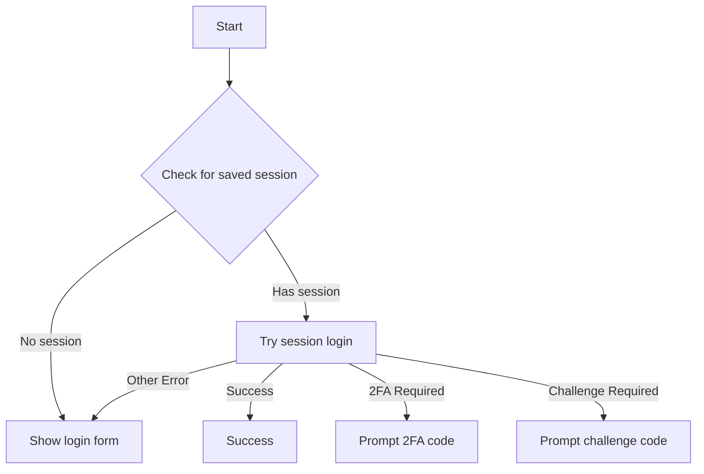
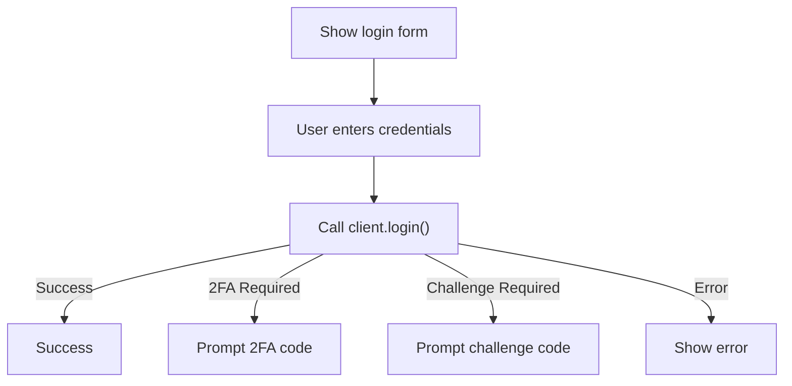
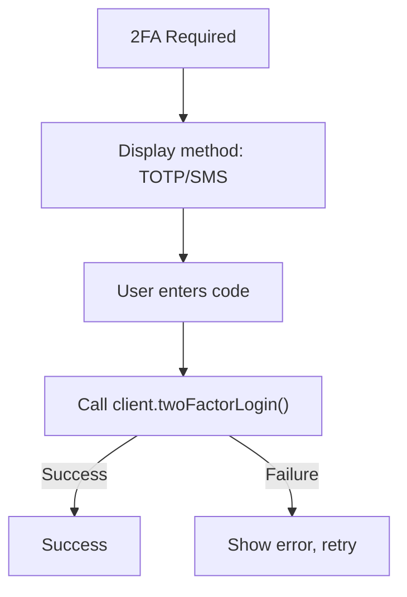
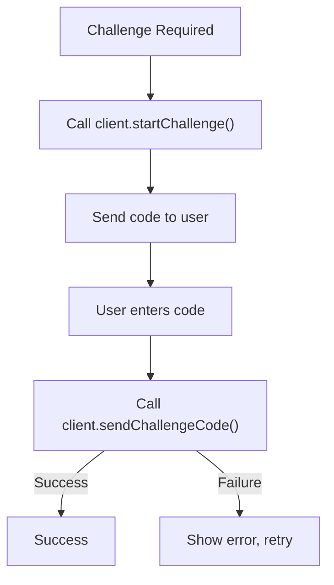

# Login Workflow Design

## Overview

The Instagram CLI implements a multi-stage login flow that handles various authentication scenarios including session-based login, username/password authentication, 2FA, and challenge-based verification. Login flow is a bit of back-and-forth between the CLI UI component (`login.tsx`) and the `InstagramClient` methods.

## Login Flow States

The login component (`login.tsx`) manages the following states:

- **`session`**: Attempting to login with saved session data
- **`form`**: Username/password login form
- **`2fa`**: Two-factor authentication code input
- **`challenge`**: Challenge verification code input
- **`success`**: Login completed successfully
- **`error`**: Login failed with error

## Workflow Sequence

### 1. Initial Session Login (Default Flow)

### 2. Username/Password Login (Manual Flow)

When `--username` flag is provided or session login fails:

### 3. Two-Factor Authentication

### 4. Challenge Verification

## Key Components

### InstagramClient Methods

- **`login(username, password)`**: Primary credential-based login
- **`loginBySession()`**: Session restoration login
- **`twoFactorLogin({verificationCode, twoFactorIdentifier, totp_two_factor_on})`**: 2FA completion
- **`startChallenge()`**: Initiates challenge flow
- **`sendChallengeCode(code)`**: Submits challenge verification

### Error Handling

- **IgLoginTwoFactorRequiredError**: Triggers 2FA flow
- **IgCheckpointError**: Triggers challenge flow
- **Network/API errors**: Displayed to user with retry options

### Session Management

- Sessions stored in `~/.instagram-cli/users/{username}/session.ts.json`
- Current username tracked in config: `login.currentUsername`
- Automatic session saving after successful login

## Debug Logging

Added debug logs for non-standard login scenarios:

- 2FA requirement detection
- Challenge requirement detection
- Login failures with error details
- Session login failures

Logs are written to `~/.instagram-cli/logs/session-{timestamp}.log`

## Configuration

Login-related config keys:

- `login.currentUsername`: Last successfully logged-in user
- `login.defaultUsername`: Default user for future sessions

## Edge Cases

- **Session expired**: Falls back to credential login
- **2FA method detection**: TOTP vs SMS based on `totp_two_factor_on`
- **Challenge retry**: Multiple attempts allowed
- **Client cleanup**: Automatic shutdown on component unmount
